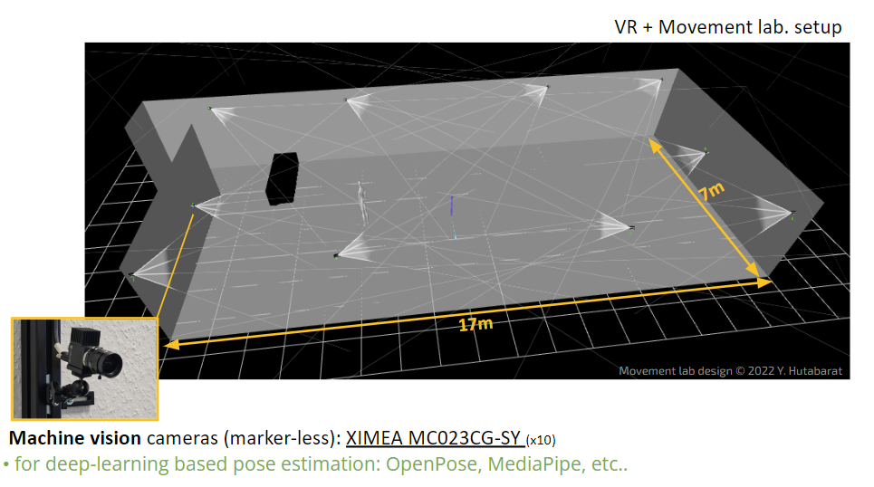

# ximea_recording
 We built a library to control, stream and capture continuous images from multiple cameras. It was first intended to run multiple machine vision cameras from Ximea (MC023CG-SY/ https://www.ximea.com/en/products/usb-31-gen-1-with-sony-cmos-xic/mc023cg-sy) but could potentially be extended to other types of cameras/machine-vision cameras.

Figure. 1. Specific lab setup with 10 ximea cameras. The start and stop recording for all of the cameras are defined by external triggers (pylsl). Multiprocessing library is utilized here to ensure the performance of multi-camera recording. The performance is defined as capturing at >Full HD, >60fps, and at least RGB24 format for each of the camera.

1. Authors Information

	A. Investigator Contact Information
  
		Name: Yonatan Hutabarat
		Institution: University of Bonn
		Email: yonatancah@gmail.com

        Name: Nicholas A. Del Grosso
		Institution: University of Bonn
		Email: delgrosso.nick@gmail.com

	B. Project Supervisor (Principal Investigator) Contact Information
  
		Name: Dominik R. Bach
		Institution: University of Bonn
		Email:  d.bach@uni-bonn.de

2. Information about funding sources that supported the development of this tool:

    > iBehave consortium, sponsored by the Ministry of Culture and Science of the State of North Rhine-Westphalia. https://ibehave.nrw

    > The Hertz Chair for Artificial Intelligence and Neuroscience in the Transdisciplinary Research Area Life and Health, University of Bonn, is funded as part of the Excellence Strategy of the German federal and state governments. https://caian.uni-bonn.de/en

    > ERC Consolidator Grant "ActionContraThreat", grant agreement ID: 816564, PI: Dominik R. Bach
    https://cordis.europa.eu/project/id/816564

This file was generated on 2023-11-02 by Yonatan Hutabarat

------------
